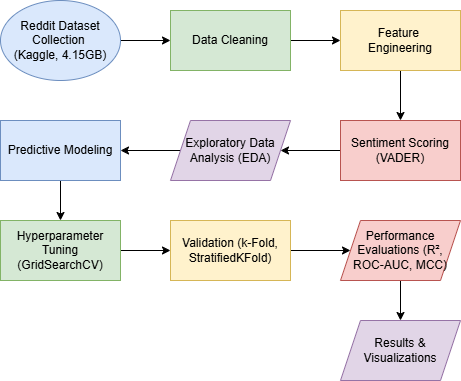

# Reddit Sentiment Analysis – Big Data Analytics Group Project

This project explores **international opinions on the Israel–Palestine conflict** using Reddit posts.  
It applies **text mining, sentiment analysis (VADER), exploratory analysis, and machine learning models** to predict sentiment trends at scale.

This work was completed as part of the **Big Data Analytics (BDA)** course at the International Islamic University Malaysia (IIUM).

---

## 📌 Project Files
| File | Description |
|------|-------------|
| **BDA_Group_Project.ipynb** | Main Jupyter Notebook containing all data cleaning, EDA, feature engineering, modeling, and evaluation steps. |
| **GP BDA.drawio.png** | Flowchart representing the full project workflow (data → processing → modeling → evaluation). |

---

## 📊 Project Title  
**Exploring International Opinions on the Israel-Palestine Conflict Through Reddit:  
A Method Based on Text Mining and Predictive Analysis**

---

## 📥 Dataset  
- Source: **Kaggle**  
- Size: **4.15 GB Reddit Dataset**  
- Link: https://www.kaggle.com/datasets/asaniczka/reddit-on-israel-palestine-daily-updated

The dataset contains Reddit posts, comments, metadata, and user-generated text used for sentiment and predictive modeling.

---

## 🧹 1. Data Cleaning  
Key steps:
- Remove URLs, emojis, special characters  
- Lowercasing and tokenization  
- Remove duplicates  
- Handle missing values  
- Stopword removal  

---

## 🏗️ 2. Feature Engineering  
- Sentiment scoring using **VADER SentimentIntensityAnalyzer**  
- Text vectorization (TF-IDF)  
- Additional engineered features:
  - Word count  
  - Character length  
  - Polarity scores  
  - Subjectivity  

---

## 🔎 3. Exploratory Data Analysis (EDA)
- Distribution of sentiment labels  
- Word clouds  
- Most frequent keywords  
- Relationship between sentiment & subreddit  
- Time-based sentiment trends  

---

## 🤖 4. Predictive Modeling  
Models applied:
- Logistic Regression  
- Random Forest  
- Gradient Boosting  
- Support Vector Machine  

Evaluation Metrics:
- **R² Score**  
- **ROC-AUC**  
- **Matthews Correlation Coefficient (MCC)**  

Model Optimization:
- GridSearchCV  
- K-Fold & Stratified K-Fold Validation  

---

## 🧪 5. Results & Conclusions  
✔ Sentiment classification models achieved strong performance using TF-IDF + VADER  
✔ Reddit posts show clear sentiment clusters related to geopolitical events  
✔ MCC and AUC provided reliable evaluation for imbalanced sentiment data  
✔ Machine learning models successfully predicted sentiment direction from text  

---

## 🔧 How to Run the Notebook
1. Install dependencies:
```bash
pip install pandas numpy matplotlib seaborn scikit-learn vaderSentiment nltk
```
2. Open Jupyter Notebook:
```bash
jupyter notebook
```
3. Run the cells in order inside BDA_Group_Project.ipynb

## 🗂️ Project Workflow Diagram



## 📄 License

This project is released for academic purposes only.
